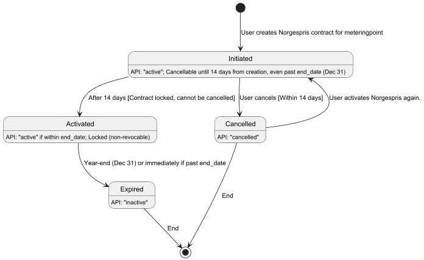
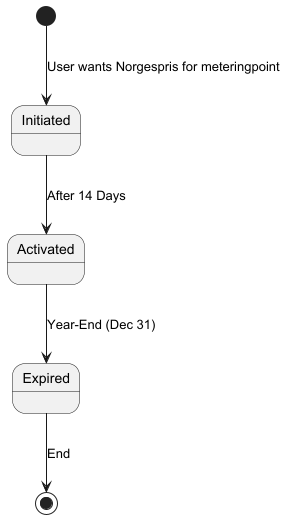

# Norgespris lifecycle overview

## Prerequisites

- [Plantuml](https://plantuml.com/)

## Overview
A Norgespris contract progresses through the following states:
- **Initiated:** The user creates a Norgespris contract for a metering point.
- **Activated:** The contract becomes active after a 14-day regret period, during which it cannot be cancelled.
- **Cancelled:** The contract is revoked, manually by the user within the 14-day regret period.
- **Expired:** The contract expires at year-end (December 31) if in the Activated state or immediately if the contract's end date has passed.

### State Transitions
The state transition for the whole norgespris status can be visualised by the image below:

#### Happy Path
The typical successful lifecycle ("happy path") of a Norgespris contract is:
- Initiated: User creates the contract.
- Activated: Contract becomes active after 14 days.
- Expired: Contract expires at year-end (December 31).

